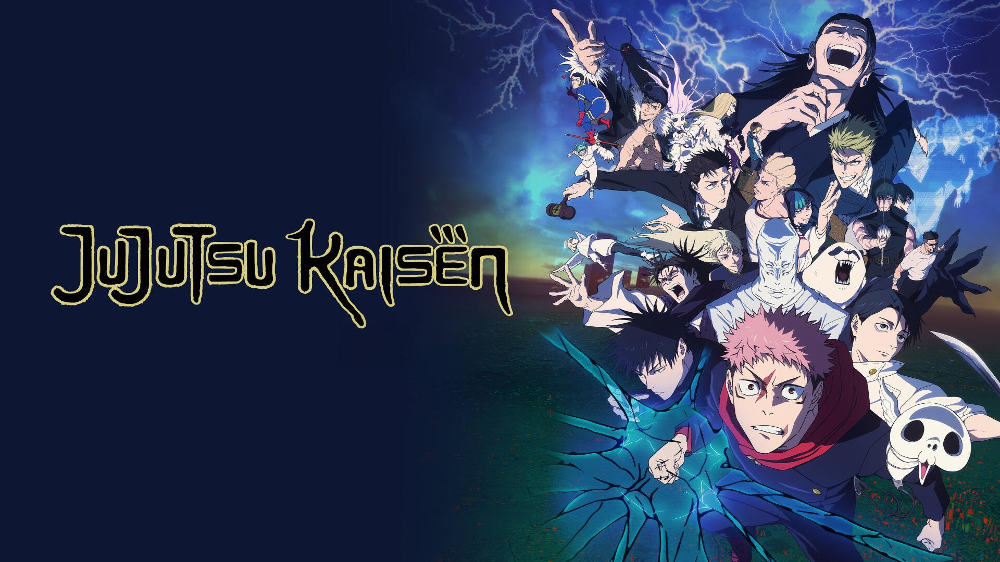
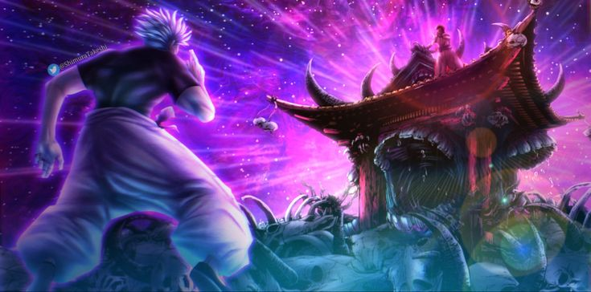

<div align="center">

# ⚔️ CurseBench — AI Sorcerer Battle Arena



**Four AI models. Ten rounds. One deterministic referee.**
*A tactical battle arena that pits language models against each other as cursed sorcerers — then scores which one actually thinks best.*

</div>

---

## What this is

**CurseBench** is a turn-based combat sim wearing a Jujutsu-Kaisen costume, but the real game is a **head-to-head AI benchmark**. You drop four models into four "seats" — local ones (via [Ollama](https://ollama.com/)) or frontier ones (Claude, GPT, Gemini, Grok, DeepSeek) — give each a name, and hit **Run Match**.

From there the **models do everything that requires intelligence**: they invent their own techniques, talk trash, form alliances, betray each other, read the board, predict opponents, and pick moves. A **pure-Python engine referees** — it computes every number, enforces the rules, and decides who's standing. The models never touch the math; they only *propose*, and the engine *resolves*.

After ten rounds, **whoever won the most rounds wins the match** — and a persistent leaderboard tracks which model wins more over time. That's the point: a fun, watchable, reproducible way to compare how well different models reason under pressure.

> It runs **fully locally and free** on Ollama. Frontier API keys are an optional drop-in upgrade.

---

## Why it's interesting (the design in one breath)

- **Models propose, the engine disposes.** Every LLM output is validated against a strict schema. Bad JSON is repaired once, then falls back to a safe move — **a bad reply never crashes a match.**
- **Self-balancing techniques.** Models invent their own attacks, but a *power-vs-complication law* forces every strong technique to carry a concrete, exploitable weakness. No god-moves.
- **Reproducible.** All randomness flows through one seeded RNG and every model reply is cached per match, so a saved match replays identically.
- **It's a spectator sport.** Live inner-monologue feeds, HP/CE bars, phase banners, and event pop-ups (`BLACK FLASH!`, `DOMAIN COLLAPSE!`, `BETRAYAL!`) make the *transcript* the product.

<div align="center">


*Four seats, four models — mix local and frontier freely.*

</div>

---

## How the game works (mechanics)

### The match structure

A match is **10 rounds**. Each round is an **independent free-for-all** — HP resets, cursed energy (CE) partially regens, but **rounds won carry over**. Most rounds won = match winner.

Rounds escalate through **three phases** that change what techniques are allowed — this stops the meta from going stale and forces the models to keep adapting:

| Phase | Rounds | Theme | Power ceiling | What it tests |
|-------|--------|-------|---------------|---------------|
| **1 — Canon** | 1–3 | Grounded, classic techniques | 7 | Pure tactics — everyone gets a same-tier kit, so only *play* differs |
| **2 — Imaginary** | 4–6 | Invented-but-lawful techniques | 9 | Creativity within the balance law; **handicaps unlock at round 5** |
| **3 — Bizarre** | 7–10 | Weird, rare, deliberately weak | 4 | Making something out of nothing |

### A single round, step by step

1. **Generate** — every living fighter gets one technique for the round. Phase 1 is engine-assigned (a balanced, unique kit); phases 2–3 are *invented by each fighter's own model* and validated.
2. **Negotiate** — fighters privately message each other. Ally-talk that's reciprocated forms an alliance; attacking a declared ally triggers **BETRAYAL**.
3. **Combat ticks** — initiative is CE-weighted with a little RNG. On their turn each fighter picks **one action** (below). The engine resolves it, then opponents may **react** (predict + counter, optional).
4. **Round ends** when one fighter is left standing (even at 1 HP). If the tick cap is hit with multiple alive, a ramping **"storm" tiebreaker** drops them one by one.
5. **Reflect** — each fighter privately updates its memory; the winner gets a debrief. A `RoundRecord` is saved to `./saves/`.

### The action menu (the move "wiki")

Every tick, a fighter's model must choose exactly one of these. This is the entire tactical vocabulary:

| Action | CE cost | What it does |
|--------|---------|--------------|
| `attack` | scales with spend | Deal damage with your technique. Can proc **Black Flash**. |
| `domain_expansion` | 45 | Open a domain — a sure-hit zone. Colliding domains have special rules (below). |
| `domain_amplification` | 20 | A cheaper offensive/defensive domain layer. |
| `simple_domain` | 15 | A defensive bubble that neutralizes incoming domains/sure-hits. |
| `heal_rct` | scales | Reverse Cursed Technique — convert CE into HP (capped by soul damage). |
| `reinforce` | scales | Spend CE to harden against the next hit (mitigation). |
| `dodge` | 0 | Free evasive action — beats low-accuracy / telegraphed attacks. |
| `ally_propose` / `ally_accept` | 0 | Form an informal alliance. |
| `betray` | 0 | Turn on an ally (logged as a special event). |
| `explain_technique` | 0 | **Reveal gamble** — your technique gets stronger, but enemies see its weakness and can plan around it. |
| `binding_vow` | 0 | From round 5: accept a permanent restriction for a validated power bump. |
| `wait` | 0 | Do nothing — but **2+ waits in a row** makes you `passive` (take +15% damage, regen less CE). Passivity is punished by design. |

### How damage is computed (the engine, not the model)

```
net_power  = power − 0.5 × (sum of complication costs)        # floor 1
ce_factor  = clamp(spend / (0.20 × max_CE), 0.4, 1.6)
base_dmg   = 7 × net_power × ce_factor
```

…then matchup multipliers (sure-hit, ranged-vs-melee, soul, reinforce, etc.), mitigation, and a hard cap (**no single hit exceeds 55% of max HP** — no one-shots). Key systems layered on top:

- **The balance law** — a technique of power *P* must carry complications totaling at least `P − 3`, and at least one must be **concrete and exploitable**. Vague drawbacks are rejected; over-ceiling power is clamped.
- **Accuracy as a read, not a dice roll** — high-accuracy attacks ignore dodging; heavily telegraphed ones auto-miss an evading reader. RNG is only a ±10% tiebreak.
- **Black Flash** — a lucky proc on a CE-melee hit (≈8% base, scaling with sustained pressure). ×2.5 crit, grants **flow** (a damage buff for the round), and banks **RCT charges** so offense fuels healing — *aggression is survival.*
- **Domains** — 2 domains colliding → higher net-power wins; **3+ colliding → total collapse, no winner** (canon rule), with HP backlash to all.

All of these constants live in one file ([config/settings.py](config/settings.py)) and are tuned with the headless simulator.

<div align="center">



*Domain expansions are the high-stakes plays — expensive, sure-hit, and catastrophic when they collide.*

</div>

---

## The AI part

Each seat is driven by a `SorcererAgent` ([interfaces/agent.py](interfaces/agent.py)) that makes a handful of **structured-JSON** calls per round. This is where the model's "intelligence" is actually measured:

| Call | When | What the model decides |
|------|------|------------------------|
| **Generate technique** | round start (phase 2–3) | Invents a balanced technique with a real weakness. |
| **Negotiate** | round start | Private messages → alliances and betrayals. |
| **Choose move** | every tick | Picks an action + target + CE spend, and returns a **live inner monologue** (`thinking`) reasoning about opponents' techniques and counters. |
| **React** | on incoming attack (optional) | Predicts the attack and plans a counter. |
| **Reveal** | optional | Decides whether to gamble on revealing a technique. |
| **Reflect** | round end | Updates private memory; the winner writes a debrief. |

Two things make weaker/local models behave:

1. **Forced structured output** — every call uses JSON mode and is validated against a pydantic schema, with a parse-repair fallback. This matters more than prompt cleverness for small models.
2. **A counter-matrix briefing** — agents are fed canon hard-counters ([game/counters.py](game/counters.py)) so they reason over the board (e.g. *don't melee into Infinity*) instead of flailing.

The model layer is **provider-agnostic** ([models/base.py](models/base.py)): the same `call_model()` drives Ollama and every frontier provider, so swapping a local 7B for Claude Opus is a one-line change at setup.

---

## Choosing your models

Seats are **model-agnostic** — any registered model can sit in any of the four seats, local and frontier mixed freely (e.g. *Claude vs Qwen vs Gemma vs Llama*). All selectable models live in one registry, [config/models.py](config/models.py).

### Local models (free, no key — via Ollama)

Install [Ollama](https://ollama.com/), then pull the default lineup (the 7–9B "sweet spot"):

```powershell
ollama pull qwen2.5:7b
ollama pull gemma2:9b
ollama pull llama3.1:8b
ollama pull mistral:7b
```

Also registered: `qwen2.5:14b`, `qwen2.5:3b`, `llama3.2:3b`, `gpt-oss:20b/120b`, `gemma3:4b/12b/27b`. Bigger = sharper tactics, slower turns.

### Frontier models (need an API key)

Add the relevant key to your `.env` and the model becomes selectable automatically (entries with no key auto-disable). Frontier seats show live token cost.

| Provider | Models in registry | Env var | Get a key |
|----------|--------------------|---------|-----------|
| **Anthropic** *(built & ready)* | Claude Opus 4.8, Sonnet 4.6, Haiku 4.5 | `ANTHROPIC_API_KEY` | https://console.anthropic.com/ |
| **OpenAI** | GPT-5.1, GPT-4.1 mini | `OPENAI_API_KEY` | https://platform.openai.com/api-keys |
| **Google** | Gemini 2.5 Pro / Flash | `GOOGLE_API_KEY` | https://aistudio.google.com/apikey |
| **xAI** | Grok 4, Grok 3 mini | `XAI_API_KEY` | https://x.ai/api |
| **DeepSeek** | DeepSeek V3, R1 | `DEEPSEEK_API_KEY` | https://platform.deepseek.com/ |

> Model names change often. Update the `api_model_name` column in [config/models.py](config/models.py) — nothing else in the codebase hardcodes them.

---

## Quick start

```powershell
# 1. install deps
pip install -r requirements.txt

# 2. config — copy the template, then (optionally) paste your API keys
copy .env.example .env

# 3. (optional) pull local models — see "Choosing your models" above

# 4. run the web app
streamlit run app.py
```

In the UI: **Setup** (pick 4 models, name them, set rounds/seed/toggles) → **Start Match** → **Run Round** / **Run Rest of Match**. Watch the live thought feed, HP/CE bars, and event banners; review per-round transcripts in **Records**; compare models in **Leaderboard**.

**Other entry points:**

```powershell
python run_console.py                       # fast console match (debugging)
python run_console.py --seats claude-sonnet-4-6 qwen2.5:7b gemma2:9b llama3.1:8b
python simulate.py --matches 50 --seed 42   # headless balance report (offline stub)
pytest -q                                   # deterministic core tests
```

> ⚠️ Local 7–9B models are slow (~15–30s per call) and a full match is many calls. For a quick watch, lower the round count, disable react/reflect, or use Claude Haiku seats.

---

## 🏆 Scoreboard (winners so far)

The arena keeps a persistent, cross-match leaderboard in `saves/leaderboard.json`, aggregated **per model** — so you can see which AI actually wins more. It's sorted by match wins, then total rounds won.

| Rank | Model | Company | Matches | Match wins | Win rate | Rounds won |
|------|-------|---------|--------:|-----------:|---------:|-----------:|
| 🥇 | _run a match to populate_ | — | — | — | — | — |
| 🥈 | — | — | — | — | — | — |
| 🥉 | — | — | — | — | — | — |

> This table auto-populates as matches finish. To print the current standings:
>
> ```powershell
> python -c "import json; b=json.load(open('saves/leaderboard.json',encoding='utf-8')); [print(f\"{m['display']:>20} | wins {m['match_wins']}/{m['matches']} | rounds {m['rounds_won']}\") for m in sorted(b['models'].values(), key=lambda x:(x['match_wins'],x['rounds_won']), reverse=True)]"
> ```
>
> *(Paste the output here to lock in the official standings. `saves/` is gitignored, so the leaderboard stays local to each machine.)*

---

## Project layout

```
app.py           Streamlit entrypoint + page router
run_console.py   console match (fast smoke / debugging)
simulate.py      headless N-match balance report
config/     settings (all tunable constants) + model registry
models/     provider-agnostic call_model(), structured-JSON, response cache
game/       state, generator (balance core), combat, engine, phases, scoring, counters
prompting/  personas, decision templates, JSON parsing/repair
interfaces/ SorcererAgent (the LLM decision calls)
views/      Streamlit views: setup, arena, records, leaderboard
util/       persistence + logging
tests/      generator-invariant + combat-determinism + fail-soft tests
```

---

<div align="center">

*Built with Python 3.11 · Streamlit · pydantic v2 · the `openai` SDK · `anthropic` · `tenacity`. No database.*


</div>
